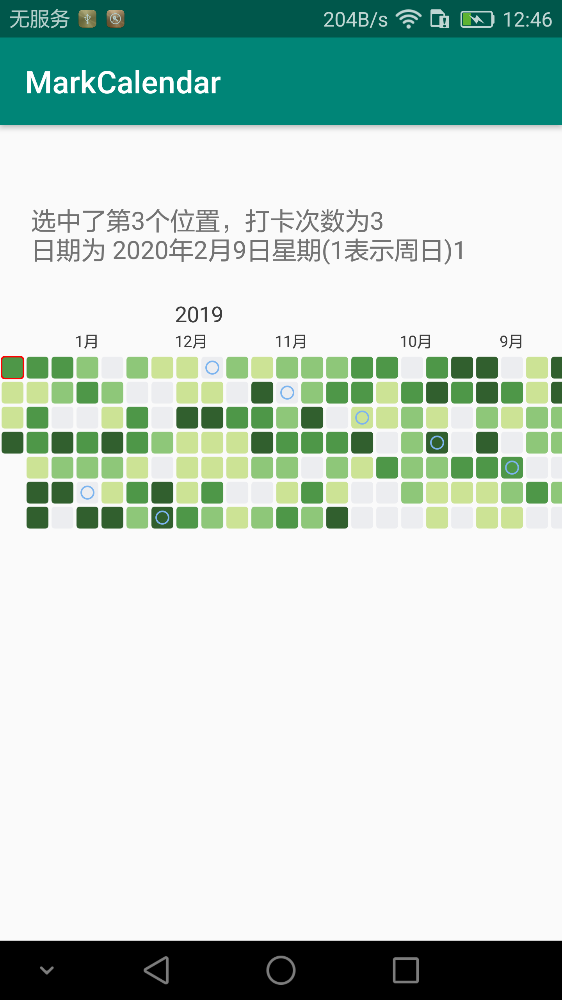
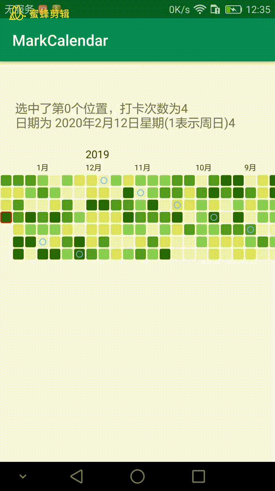

# MarkCalendarView
仿github、leetcode、豆瓣观影记录的打卡日历view

## 效果图：

 

 

## 使用：

1、直接使用`MarkCalendarView` :xml中使用它，在代码中调用`markCalendarViewsetDatas(Calendar startDate, List<Bean> datas)`传入时间数据。 
2、打卡数据很多，建议使用RecyclerView。已提供对应的adapter:`MarkCalendarRecyclerViewAdapter`。demo见`DemoActivity`
